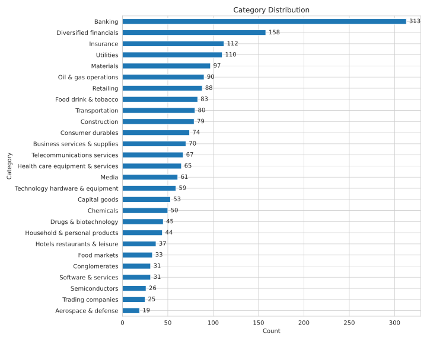
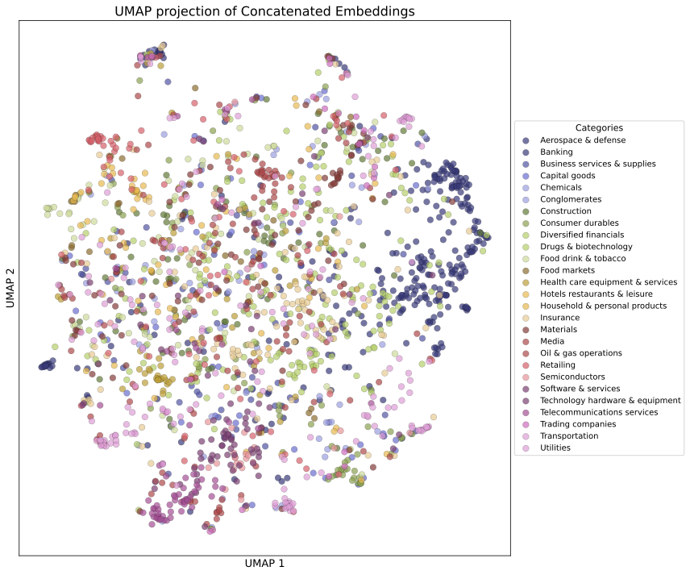
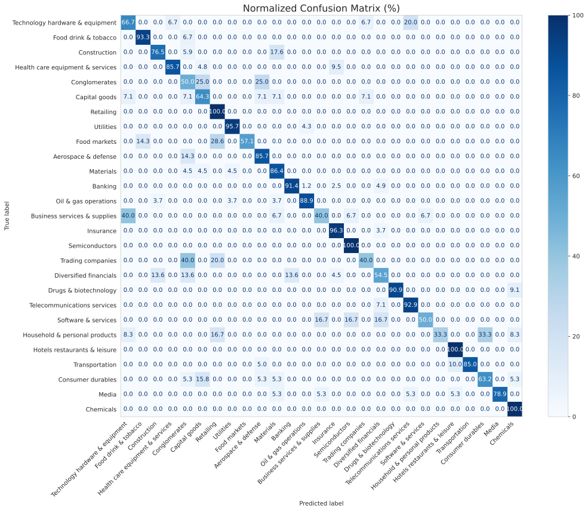

# Report - Company Category Classification

## Introduction
The goal of this project is to classify company names into one of the predefined categories.
The only available information about each company is its name.
Evaluation is performed on a dataset consisting of the Forbes 2000 largest companies.

Due to time constraints imposed by the faculty, I developed a simplified proof-of-concept solution, which can be extended in future iterations.

## Dataset
Upon examining the dataset, I observed that the classes are imbalanced.
Some categories, such as *Banking*, *Diversified Financials*, and *Insurance*, are more prevalent, while others like *Aerospace & Defense* and *Trading Companies* each represent only about 1% of the dataset.

Additionally, company names alone are not highly informative. To achieve strong model performance, a model with substantial prior knowledge would be required, or alternatively, additional information and features about the companies should be incorporated.

<p align="center">
  
</p>

This dataset contains only valid company names. If the production data includes invalid or non-existent names, it may be beneficial to augment the training data with invalid or random character sequences and introduce an additional *Invalid* class to handle such cases.


## Approaches

As mentioned above, the company name alone may not provide enough information to accurately determine the company category. To address this, I decided to add additional information about each company. This can be done using various APIs or databases that provide relevant company data.

For my proof of concept, I used the Wikipedia API to fetch the introductory text for each company, when available. However, other sources—such as [Clearbit](https://clearbit.com/) can easily be integrated to provide richer context.

Given the nature of the task, the following approaches are well-suited for classifying company names:

- **LLM with pre-existing knowledge**  
  A large language model with broad world knowledge can be used to classify company names, with or without additional context included in the prompt.  
  In this project, I used the free tier of Google’s Gemini platform with the `gemini-2.0-flash-lite` model.

- **Embedding model + classifier**
  - **Embeddings**:  
    These can be generated using OpenAI’s `text-embedding-ada-002` model or a locally hosted Sentence-Transformer.  
    Since `text-embedding-ada-002` is a paid service, I opted for a Sentence-Transformer model running locally.
    
  - **Classifier**:  
    A machine learning classifier can be trained on top of the embeddings. Suitable choices include a multi-layer perceptron, XGBoost, SVM, etc.  
    For simplicity, I used XGBoost.

- **BERT-like classifier**  
  A BERT-based model can be fine-tuned to predict the company category using the company name and optionally its description.

Due to the dataset’s relatively small size and class imbalance, I decided that fine-tuning a large model (either an LLM or an embedding model) would likely not yield a significant performance improvement and can lead to overfitting.


### Gemini-2.0-flash-lite with prompt engineering
In this approach, I use prompt engineering to query the Gemini-2.0-flash-lite model and retrieve the company category.  
The interaction with the Gemini API is implemented using Langchain.
#### System prompt
```
You are a helpful assistant that helps the user categorize a company name into one of the following categories:
{categories}
If the company name does not fit into any of the categories, please respond with "Other".
Please respond with the category name only, without any additional text.
```
If additional information about the company is available, one more sentence is added after the category list:

```
Along the name you will receive a short description of the company. Use this information to categorize the company name into one of the categories.
```
#### User Prompt
The final prompt sent to the model includes the company name and, if available, a description:

```
Categorize the following company name: {company_name}
Description: {description}
```

If no description is found for a company, the method falls back to using only the company name.

Additional logic is implemented to verify whether the model's response matches a valid category from the predefined list.


### Sentence-Transformer embeddings + XGBoost

#### Embeddings
Since the raw company name string does not contain enough information for direct classification, I used the Sentence-Transformer model `all-MiniLM-L6-v2` to extract embeddings for input into the classifier.

This model is a distilled version of BERT with 6 transformer layers and approximately 22.7 million parameters. It is a compact model optimized for sentence embedding and produces 384-dimensional vector representations. The input length is limited to 256 word pieces and longer inputs are truncated.

For this task, I extracted embeddings from both the *company name* and its *description* (if available). If a description was missing, a constant embedding (representing an empty string) was used.

To combine the *company name* and *description* embeddings, I experimented with two strategies:
- **Concatenation**: combining the two vectors, resulting in a 768-dimensional input
- **Averaging**: computing the average of the two embeddings, maintaining a 384-dimensional input

Since company descriptions can exceed the input length limit, I used only the first two sentences of each description for embedding. While using more of the description could yield richer representations, I opted for this shorter input to keep training efficient.

#### Classifier
For classification, I used XGBoost. Due to class imbalance in the dataset, I applied class weighting by assigning weights inversely proportional to the class frequencies in the training set.

Although I planned to perform hyperparameter tuning using 10-fold cross-validation, this step was skipped due to time constraints, as it would significantly increase training time.

### Baseline
Although I did not implement a baseline, a simple rule-based approach could be developed for comparison. For example, it could rely on keyword matching or regular expressions—checking if a category name or its synonym appears in the company name. This would provide a useful benchmark to evaluate the performance of the more advanced methods.


## Results
To evaluate model performance, I used a stratified train/test holdout split with a 70%/30% ratio. The test set consists of 600 instances.


### 📊 Combined Model Performance Metrics

| Metric     | Avg Embed.      | Concat Embed.    | Gemini (no desc.)       | Gemini (with desc.)     |
|------------|---------------------|----------------------|----------------------|----------------------|
| Accuracy   | 0.4217 ± 0.0198     | 0.4483 ± 0.0202      | **0.7760 ± 0.0183**      | 0.7260 ± 0.0197      |
| F1 Score   | 0.4108 ± 0.0201     | 0.4372 ± 0.0211      | **0.7878 ± 0.0184**      | 0.7441 ± 0.0200      |
| Precision  | 0.2972 ± 0.0180     | 0.3652 ± 0.0233      | **0.7556 ± 0.0222**      | 0.7506 ± 0.0283      |
| Recall     | 0.3056 ± 0.0176     | 0.3511 ± 0.0212      | **0.7165 ± 0.0230**      | 0.6541 ± 0.0254      |

In the table above, the first two columns represent the embedding + classifier methods, while the last two correspond to the Gemini prompt-engineered methods.  
Uncertainty is expressed as the standard error, estimated via bootstrapping.  
Note that **recall** and **precision** are macro-averaged across all classes, while **F1 score** is weighted (I discovered this later and did not rerun the script).

Based on the results, the clear winner is the **Gemini model prompted only with the company name**. Surprisingly, this setup outperformed the version where additional company descriptions were included in the prompt.

The embedding + classifier approaches struggled with accurate classification. One possible explanation is that the embedding model failed to capture meaningful similarities from the company names and descriptions.  
This is supported by the `UMAP` 2D projection of the embeddings, where no well-defined class clusters are visible.  
This suggests that performance might be improved by using a more powerful embedding model.

<p align="center">
  
</p>

<br>
<br>

### Misclassification analysis
To gain insights into where the best-performing model, *Gemini without description*, struggles, I examined the confusion matrix.

The most misclassified instances occur when the predicted class is similar to the true label. For example, 40% of the `Business Services & Supplies` were predicted as `Technology Hardware & Equipment`, and 33% of the `Household & Personal Products` were predicted as `Consumer Durables`.  
This suggests that some category names may be somewhat ambiguous, making it difficult to classify them into a single category.


<p align="center">
  
</p>


Additionally, I investigated instances where the *Gemini model with description* was incorrect, but the *Gemini model without description* made the correct prediction.  
For example, the company `Comcast` has a ground truth label of `Media`, but the model with the description predicted it as `Telecommunications Services`, while the model without the description classified it correctly as `Media`.  
Upon reviewing the Wikipedia introduction, it states that Comcast operates in both telecommunications and entertainment, which may explain the confusion in the description-based model.

```
Comcast Corporation, formerly known as Comcast Holdings, is an American multinational mass media corporation that the company works in telecommunications and entertainment...
```


## Conclusion
The best-performing model on the Forbes 2000 biggest companies dataset is *Gemini prompted only with the company name*, achieving an accuracy of **77.6%** on the test set.  
Several concerns regarding category ambiguity suggest that a potential improvement could be to assign multiple labels to companies or use more coarse-grained categories.

Further improvements can be made by utilizing more powerful embedding models, retrieving company information from multiple sources, and leveraging larger LLMs.

